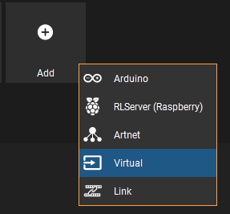
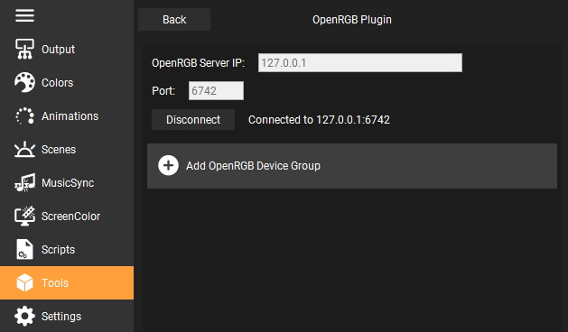

# OpenRGB-Plugin
Add [OpenRGB](https://gitlab.com/CalcProgrammer1/OpenRGB) support to [RemoteLight](https://github.com/Drumber/RemoteLight) and control your whole RGB setup!

## Features
- control any RGB hardware supported by OpenRGB ([supported devices](https://gitlab.com/CalcProgrammer1/OpenRGB/-/wikis/Supported-Devices))
- create as many output devices as you want/need
- all RemoteLight effects/animations can be used
- acts like a normal RemoteLight output

## Usage
1. [Download RemoteLight](https://github.com/Drumber/RemoteLight/releases) (minimum version v0.2.4-rc2)
2. Download OpenRGB-Plugin (download soon) and place it in the plugins folder `%userprofile%/.RemoteLight/plugins`
3. [Download OpenRGB](https://gitlab.com/CalcProgrammer1/OpenRGB) and [set it up](https://gitlab.com/CalcProgrammer1/OpenRGB/-/wikis/OpenRGB-Windows-Setup-and-Usage)
4. Create a virtual output in RemoteLight  

5. Go to `Tools > OpenRGB Plugin` and add a new OpenRGB device  

6. Start OpenRGB SDK Server  

7. Setup OpenRGB connection data and select the previously created virtual output  

8. Go back to the Output panel and activate the virtual output
9. Client should be connected  
