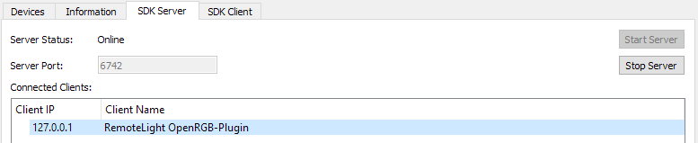

# OpenRGB-Plugin
Add [OpenRGB](https://gitlab.com/CalcProgrammer1/OpenRGB) support to [RemoteLight](https://github.com/Drumber/RemoteLight) and control your whole RGB setup!

## Features
- control any RGB hardware supported by OpenRGB ([supported devices](https://gitlab.com/CalcProgrammer1/OpenRGB/-/wikis/Supported-Devices))
- create as many output devices as you want/need
- all RemoteLight effects/animations can be used
- acts like a normal RemoteLight output

## Usage
1. [Download RemoteLight](https://github.com/Drumber/RemoteLight/releases) (minimum version v0.2.4-rc2)
2. [Download OpenRGB-Plugin](https://github.com/RemoteLight/OpenRGB-Plugin/releases) and place it in the plugins folder `%userprofile%/.RemoteLight/plugins`
3. [Download OpenRGB](https://gitlab.com/CalcProgrammer1/OpenRGB) and [set it up](https://gitlab.com/CalcProgrammer1/OpenRGB/-/wikis/OpenRGB-Windows-Setup-and-Usage)
4. Create a virtual output in RemoteLight  

5. Go to `Tools > OpenRGB Plugin` and add a new OpenRGB device  

6. Start OpenRGB SDK Server  

7. Setup OpenRGB connection data and select the previously created virtual output  

8. Go back to the Output panel and activate the virtual output
9. Client should be connected  


## FAQ
### Why do I need to create a virtual output?  
The OpenRGB plugin uses the virtual output to get the LED color data from RemoteLight. It also allows OpenRGB devices to be used together with other regular RemoteLight output devices. With the Chain and Multi outputs, it is also possible to control multiple devices simultaneously.

### Can I use multiple OpenRGB devices with the same virtual output?
Yes, but also no. The plugin overwrites the pixel number of the configured virtual output with the number of LEDs received from OpenRGB. If the OpenRGB devices have different amount of LEDs, they will try to overwrite the pixel number of the virtual output and interfere with each other. To be safe that everything works, just **create a separate virtual output for each OpenRGB device**. To be able to use them simultaneously, you can use for example a Chain or Multi output.

### Do I have to keep OpenRGB running?
Yes, the plugin only sends the color data generated by RemoteLight to the OpenRGB SDK server. OpenRGB does the controlling of the hardware and must therefore of course keep running.

### I have a problem with OpenRGB, so can you help me?
I am not involved in the development of OpenRGB and therefore have no idea about the program structure. The plugin just uses the SDK interface provided by OpenRGB. If you have **problems or questions regarding OpenRGB**, you can get help on the [OpenRGB repository](https://gitlab.com/CalcProgrammer1/OpenRGB). **Please contact me only if the bug is related to the plugin itself.**

### Can I use the Java OpenRGB wrapper as a library for my own project?
Yes, the Maven project is divided into 2 modules: [openrgb-wrapper](https://github.com/RemoteLight/OpenRGB-Plugin/tree/master/openrgb-wrapper) and [openrgb-plugin](https://github.com/RemoteLight/OpenRGB-Plugin/tree/master/openrgb-plugin). To use the OpenRGB interface you only need to add the openrgb-wrapper module as a dependency to your project.  
Easy to use with [JitPack](https://jitpack.io/#RemoteLight/OpenRGB-Plugin):  
```xml
	<dependency>
	    <groupId>com.github.RemoteLight.OpenRGB-Plugin</groupId>
	    <artifactId>openrgb-wrapper</artifactId>
	    <version>Tag</version>
	</dependency>

	<repositories>
		<repository>
		    <id>jitpack.io</id>
		    <url>https://jitpack.io</url>
		</repository>
	</repositories>
```
[*How to use JitPack with Multi-module projects*](https://jitpack.io/docs/BUILDING/#multi-module-projects)
> A short hint: The project uses some Kotlin features, so Kotlin is also needed as dependency.
